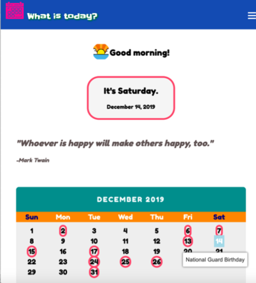

# WhatsToday App

Link to live app:
https://lilian-wong.github.io/WhatsToday-API/

## Summary:
Users are greeted based on the timing of the location of their IP addresses. They
will find the date of today along with a calendar for the current month. A random
quote is displayed when user visits the site. National and observance holidays retrieved from calendarific API arecircled on the calendar. To see the name of the circled holiday, users can hover over the circled date. Today is highlighted in a light blue color. Users can search for a list of historical holidays and coming up with holidays up to 2049.
Users can click Astronomy Picture of the Day link and the Astronomy Picture of the day will be displayed (retrieve from NASA). When a user clicks the Check Weather link, 
a dialog box will pop up listing today's temperature, humidity, and weather.

## Feature:
Search holiday
Get Astronomy Picture of the day
Get today's weather

## Key technologies used:
Javascript, CSS, HTML, JQuery
